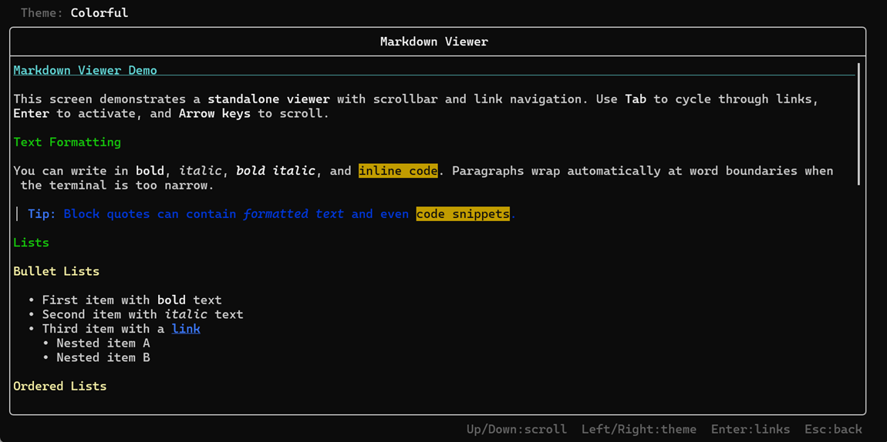

# MarkdownFTXUI

A C++ library for rendering and editing Markdown directly in the terminal. Built on [FTXUI](https://github.com/ArthurSonzogni/FTXUI), it gives TUI applications a rich-text Markdown viewer with headings, inline formatting, navigable links, code blocks, and lists — plus a syntax-highlighted editor with line numbers and live preview. Ideal for terminal-based note-taking apps, email clients, documentation browsers, or any TUI that needs to display or edit Markdown content.

| Editor + live preview | Standalone viewer (Colorful theme) |
|---|---|
|  |  |

## Features

- **Editor** with lexical syntax highlighting, line numbers, and cursor tracking
- **Viewer** with semantic Markdown rendering (bold, italic, headings, links, lists, code, quotes)
- **Link navigation** via Tab/Shift+Tab with Enter to activate
- **External focusable items** for integrating non-Markdown elements (e.g. email headers) into the Tab ring
- **Three built-in themes** (Default, High Contrast, Colorful) with custom theme support
- **Scrollable content** with scrollbar indicator and ratio-based scroll control
- **UTF-8 and CJK support** with correct wide character handling
- **Parser abstraction** -- cmark-gfm is fully hidden behind a clean interface
- **CMake install targets** with `find_package` support

## Quick Start

Add MarkdownFTXUI to your CMake project:

```cmake
include(FetchContent)

FetchContent_Declare(
    markdown-ui
    GIT_REPOSITORY https://github.com/<your-org>/MarkdownFTXUI.git
    GIT_TAG        main
    GIT_SHALLOW    TRUE
)
FetchContent_MakeAvailable(markdown-ui)

target_link_libraries(your_target PRIVATE markdown-ui)
```

Minimal viewer example:

```cpp
#include "markdown/parser.hpp"
#include "markdown/viewer.hpp"

#include <ftxui/component/screen_interactive.hpp>

int main() {
    auto viewer = std::make_shared<markdown::Viewer>(
        markdown::make_cmark_parser());

    viewer->set_content(
        "# Hello World\n\n"
        "This is **bold**, *italic*, and `code`.\n\n"
        "- Item one\n"
        "- Item two with a [link](https://example.com)\n");

    viewer->show_scrollbar(true);
    viewer->on_link_click([](std::string const& url, markdown::LinkEvent ev) {
        if (ev == markdown::LinkEvent::Press) {
            // Handle link activation
        }
    });

    auto screen = ftxui::ScreenInteractive::Fullscreen();
    screen.Loop(viewer->component());
}
```

## Building from Source

```bash
cmake -B build
cmake --build build --config Release
ctest --test-dir build -C Release
```

Requirements: CMake 3.25+, C++20 compiler. Dependencies (FTXUI, cmark-gfm) are fetched automatically.

See [docs/building.md](docs/building.md) for installation, `find_package` usage, and MSVC-specific notes.

## Architecture

```
  Markdown string
       │
       ▼
  MarkdownParser::parse()        cmark-gfm (hidden)
       │
       ▼
  MarkdownAST                    Tree of ASTNode
       │
       ▼
  DomBuilder::build()            Applies Theme decorators
       │
       ▼
  ftxui::Element                 FTXUI virtual DOM
       │
       ▼
  Terminal output
```

The Editor takes a separate path: it performs lexical (character-level) highlighting directly on raw text without parsing into an AST.

See [docs/architecture.md](docs/architecture.md) for component diagrams, caching strategy, and event handling details.

## Demo Application

```bash
# After building:
build/demo/Release/markdown-demo.exe   # Windows
./build/demo/markdown-demo              # Linux / macOS
```

Three demo screens:

| Screen | Description |
|--------|-------------|
| Editor + Viewer | Side-by-side editing with live preview and cursor-synced scroll |
| Viewer with Scroll | Full-screen viewer with scrollbar and Tab-based link navigation |
| Email Viewer | Simulated email with header fields in the Tab ring (external focusables) |

See [docs/demos.md](docs/demos.md) for screen layouts, code patterns, and keyboard reference.

## API at a Glance

| Header | Purpose |
|--------|---------|
| `ast.hpp` | `NodeType` enum, `ASTNode` struct, `MarkdownAST` type alias |
| `parser.hpp` | `MarkdownParser` interface, `make_cmark_parser()` factory |
| `viewer.hpp` | `Viewer` class, `LinkEvent`, `ExternalFocusable` |
| `editor.hpp` | `Editor` class with cursor tracking and syntax highlighting |
| `dom_builder.hpp` | `DomBuilder` class, `LinkTarget` struct |
| `highlight.hpp` | `highlight_markdown_syntax()`, `highlight_markdown_with_cursor()` |
| `theme.hpp` | `Theme` struct, `theme_default()`, `theme_high_contrast()`, `theme_colorful()` |
| `scroll_frame.hpp` | `DirectScrollFrame`, `direct_scroll()` |
| `text_utils.hpp` | UTF-8 utilities, CJK width, gutter helpers |

See [docs/api-reference.md](docs/api-reference.md) for complete signatures and code examples.

## Design Decisions

- **No tables or GFM extensions** -- the library targets simple Markdown for planning documents and emails. Terminal table rendering is complex and fragile across terminal sizes.
- **Parser abstraction** -- cmark-gfm is fully encapsulated. Consumers never include cmark headers or deal with its static linking quirks.
- **Lexical vs semantic highlighting** -- the Editor uses fast character scanning; the Viewer uses full AST-based rendering with generation-counter caching.
- **Decorator-based themes** -- themes are `ftxui::Decorator` values, giving full access to FTXUI's composable styling system.

See [docs/design-decisions.md](docs/design-decisions.md) for detailed rationale on each decision.

## Testing

24 test executables covering parser, DOM builder, editor, viewer, themes, Unicode, and edge cases.

```bash
ctest --test-dir build -C Release --output-on-failure
```

See [docs/testing.md](docs/testing.md) for the full test list and instructions for adding new tests.

## Supported Markdown Elements

| Syntax | Rendering |
|--------|-----------|
| `# H1` | Bold + underlined |
| `## H2` | Bold |
| `### H3` - `###### H6` | Bold + dim |
| `**bold**` | Bold |
| `*italic*` | Italic |
| `***bold italic***` | Bold + italic |
| `[text](url)` | Underlined (navigable with Tab/Enter) |
| `- item` | Bullet list with indentation |
| `1. item` | Ordered list with numbering |
| `` `code` `` | Inverted (inline) |
| ` ``` ` code block ` ``` ` | Bordered box |
| `> quote` | Vertical bar prefix + dim |
| `---` | Horizontal separator |
| `` | `[img: alt]` placeholder |

## Used By

- [Mailtemi](https://mailtemi.com/) -- a privacy-focused multi-account email app (JMAP-first, MS Graph, IMAP). Currently uses MarkdownFTXUI for testing Markdown email rendering; a full TUI client is planned for the future.

## License

This project is licensed under the [MIT License](LICENSE).
